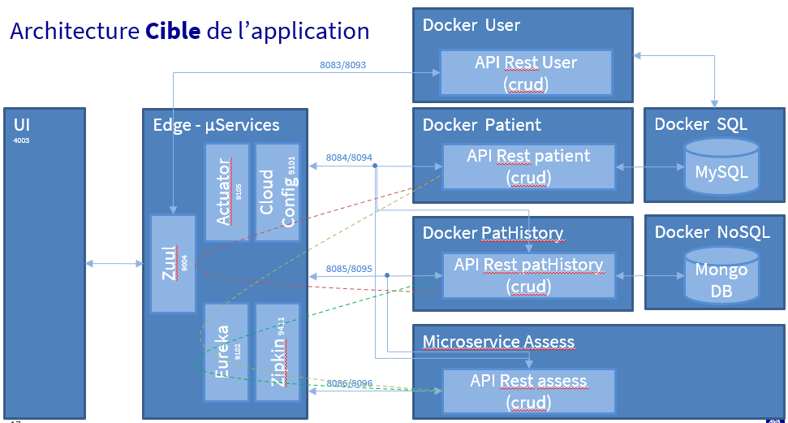

# SoftwareAcademy-P9-Notes
Micro-service NOTES manage the praticiens notes for patients on MEDISCREEN Application. 

This microservice use SPRINT BOOT, Feign Client. 

## Getting Started
EndPoint for global application  : 
* http://localhost:4200

# Prerequis
For NOTES microservice
* Java 1.8 or later
* Spring Boot 2.2.6
* MongoDB
* Docker 2.5.0.0 or later (optional)

For Global application
* Java 1.8 or later
* MySQL
* MongoDB
* Spring Boot 2.2.6
* Docker 2.5.0.0 or later (optional)
* Angular
* Zipkin
* Eureka
* Config server

## Installation
Check PatientV2 Readme.md for global installation 

### Docker image construction in project directory :
docker build --build-arg JAR_FILE=target/*.jar -t p9-notes .

### Docker execution if docker-compose is not use
docker run -p 8085:8085 --name notes p9-notes

### Database installation
On MongoDB
* create the database "mydatabase"
* create the user "mediscreen" with readWrite option
* create the collection "note"

## URI
### Get all notes in database
* directly : GET http://localhost:8085/patHistories
* With zuul : GET http://zuul:9004/microservice-notes/patHistories

### Get one note by note id
* directly : GET http://localhost:8085/patHistory/id_de_note
* With zuul : GET http://zuul:9004/microservice-notes/patHistory/id_de_note

### Get note list for a patient id
* directly : GET http://localhost:8085/patientpatHistories/id_de_patient
* With zuul : GET http://zuul:9004/microservice-notes/patientpatHistories/id_de_patient

### Add a note list for a patient id
* directly : POST http://localhost:8085/patHistory/add
* With zuul : POST http://zuul:9004//microservice-notes/patHistory/add

Body exemple :
{   
    "patientId": "2",
    "textNote": "Blabla ",
    "dateNote": "1966-12-30"
}

### Update a note list for a patient id
* directly : PUT http://localhost:8085/patHistory/
* With zuul : PUT http://zuul:9004//microservice-notes/patHistory/

Body exemple :
{   
    id": "60227a4171603d6e9bacf540",
    "patientId": "2",
    "textNote": "Blabla ",
    "dateNote": "1966-12-30"
}

### Delete a note list for a patient id
* directly : DEL http://localhost:8085/patHistory/
* With zuul : DEL http://zuul:9004//microservice-notes/patHistory/

Body exemple :
{   
    id": "60227a4171603d6e9bacf540",
    "patientId": "2",
    "textNote": "Blabla ",
    "dateNote": "1966-12-30"
}

## Divers
Global architecture : 
